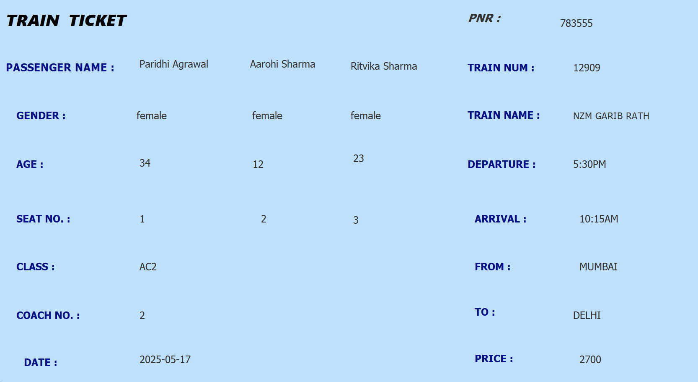

# RailwayReservationSystem
A Java-based Railway Reservation System with a graphical user interface (GUI) and SQLite backend.
This project allows users to book and cancel train tickets, view train schedules, and manage passenger information, while admins can manage train and route details.
| Layer      | Technology / Tool       | Purpose                                         |
|----------- |------------------------|------------------------------------------------|
| Frontend   | Java Swing             | GUI for login, registration, booking, train schedule, passenger details |
| Backend    | Java (JDBC)            | Application logic, validation, and database communication |
| Database   | SQLite                 | Stores train schedules (`train.db`) and user/passenger info (`userDetails.db`) |
| IDE        | Eclipse / IntelliJ IDEA| Development environment for coding and running the project |
| Version Control | Git & GitHub       | Code management, version control, and repository hosting |
Project Features
User / Admin Management

Login / Registration:

New users can create accounts.

Existing users (both admin and regular users) enter user ID and password to log in.

Password and ID validation:

userDetails.db ensures correct credentials for both admin and users.

Admin Panel

Add, delete, or modify train/schedule/no. of seats etc.

Manage train schedules, seat availability, and route information.

Train Search & Booking

Search trains by source, destination, and date.

Seat availability table displays number of seats in each coach:

AC1 / AC2 / AC3 / Sleeper

Real-time database updates: Seat availability is updated immediately in the database when tickets are booked or canceled.

Ticket Management

Virtual ticket generation:

After final booking, a virtual ticket is generated showing passenger details, train information, and booking confirmation.

Booking cancellation: Updates seat availability in real time.

View booking history for users.

Database Management

SQLite databases:

train.db stores train schedules and seat availability.

userDetails.db stores user accounts and booking information.

JDBC used to connect frontend and backend with databases.

How it Works

Users or admins log in or register (if new).

Admins can manage train and route details via the admin panel.

Users can search for trains and see seat availability per coach.

Users book tickets; databases are updated in real time.

A virtual ticket is generated upon confirmation, containing passenger and train details.

Tickets can be canceled; seat availability is updated accordingly.

